# Lab11web
## Pratikum 11
untuk memenuhi tugas pemogramman web
Nama     : Antini permatasari 
NIM      : 312010095 
kelas    : TI.20.B.1 

### Berikut ini adalah soal tugas praktikum 11 pertemuan 12 
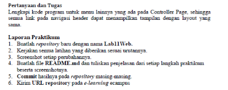 

1. Pertama-tama kita Buka dulu xampp controlnya lalu kalian klik start dan klik config lalu pilih PHP(php.ini) 
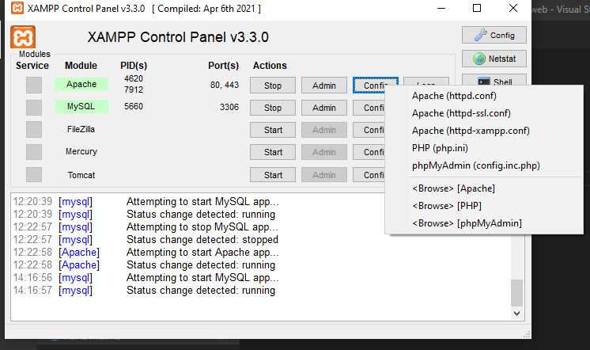 
2. Kemudian kalian hapus tanda (;) pada bagian extension=intl seperti berikut 
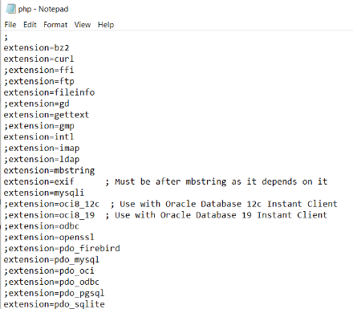 
3. Selanjutnya kita akan download CodeIgniter4 atau kalian bisa click disamping [Click Here](https://codeigniter.com/download) 
4. Setelah sudah di download,selanjutnya kita ubah extract rename menjadi ci4 seperti dibawah ini 
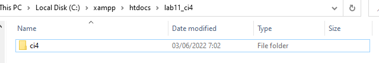 
5. Selanjutnya kita pindahkan kedalam folder htdocs > lab11_ci, setelah itu kalian buka localhost/lab11_ci/ci4/public 
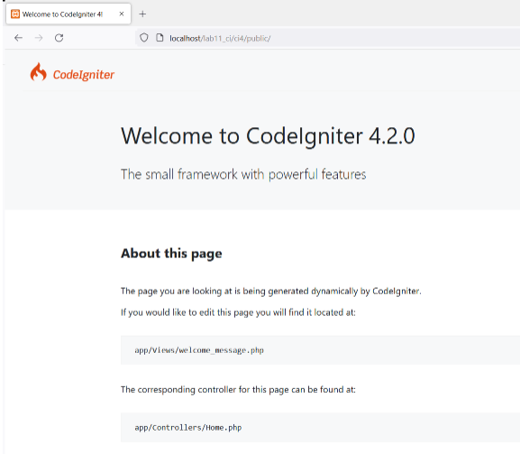 
6. selanjutnya kita buka CMD dengan cara buka kembali xampp control lalu pilih bagian Shell,lalu kita tulis seperti dibawah ini 
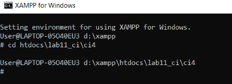 
7. selanjutnya kitatulis php spark maka akan muncul seperti dibawah ini 
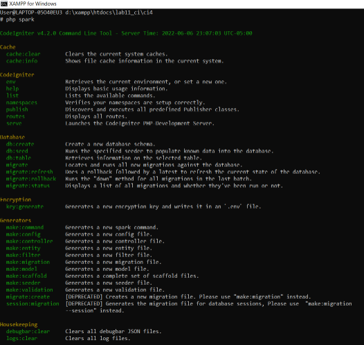 
8. kemudian kita akan mengaktifkan fitur debugging untuk mengatahui pesan error, jika belum aktif maka tampilannya akan seperti dibawah ini 
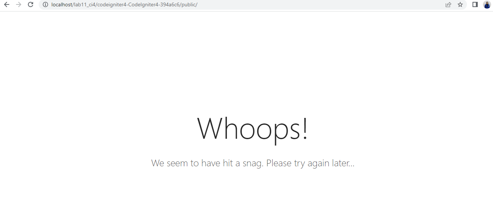 
9. Untuk mengaktifkannya kita buka env ubah atau rename menjadi .env, lalu kalian hapus (#) pada CI_ENVIRONMENT dan kita ubah juga menjadi development seperti dibawah ini 
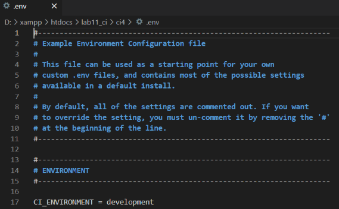 
10. kemudian coba kita hapus tanda (;) pada Home.php, lalu akan muncul info terjadi kesalahan pada bagian tertentu seperti dibawah ini 
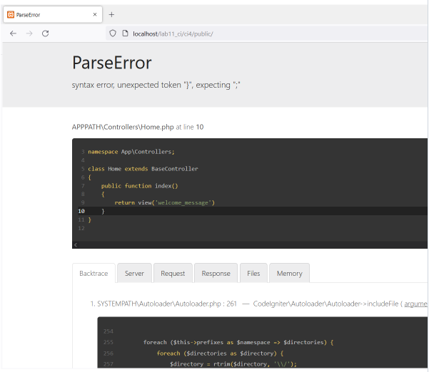 
11. Setelah semua selesai, selanjutnya kita akan membuat router baru seperti berikut di File Routes terletak pada file app/config/Routes.php 
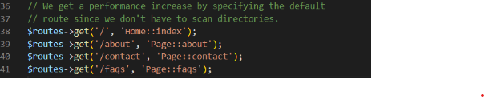 
12. kemudian kita cek lagi apakah router sudah benar pada Shell di xampp control, jika sudah maka tampilannya akan menjadi seperti dibawah ini 
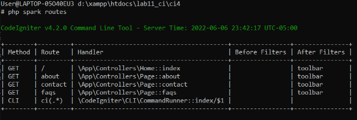 
13. selanjutnya kita cek about di web page, maka tampilannya akan seperti dibawah ini 
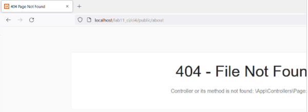 
14. Selanjutnya kita akan membuat controller dengan membuat file baru dengan nama page.php pada folder Controllers sebagai berikut. 
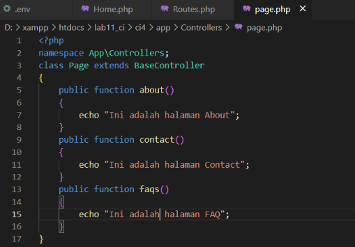 
Berikut ini tampilannya 
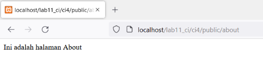 
15. lalu kita akan membuat auto routing lalu kita menambahkan syntax dibawah ini pada folder config > Routes.php 
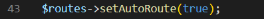 
kemudian kita akan membuat syntax berikut pada folder Controllers > page.php 
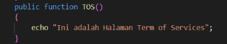 
lalu tampilannya akan seperti berikut ini 
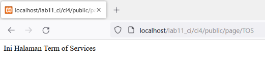 
16. Selanjutnya kita akan membuat tampilan web,lalu kita buat about.php dengan syntax sebagai berikut 
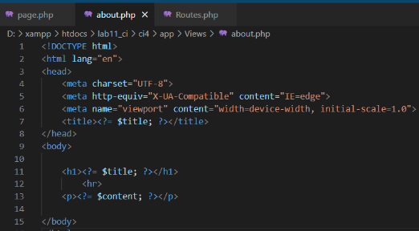 
Setelah itu kita rubah bagian about di page.php pada folder Controllers seperti dibawah ini 
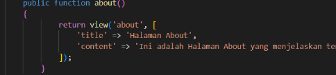 
Berikut ini adalah tampilannya 
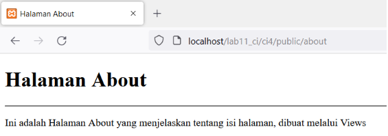 
17. Selanjutnya kita edit pada bagian about.php menjadi seperti berikut 
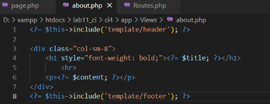 
Maka tampilan akhirnya akan menjadi sebagai berikut 
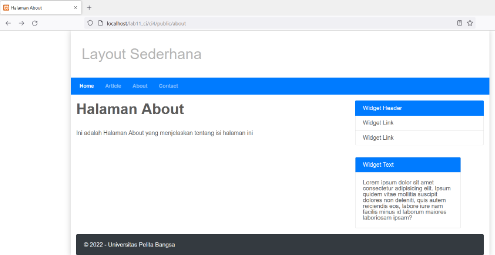 

### Jawaban Pertanyaan & Tugas
Berikut ini adalah tampilan pada semua link navigasi header 
1. About 
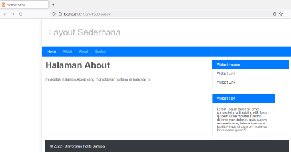 
2. Article 
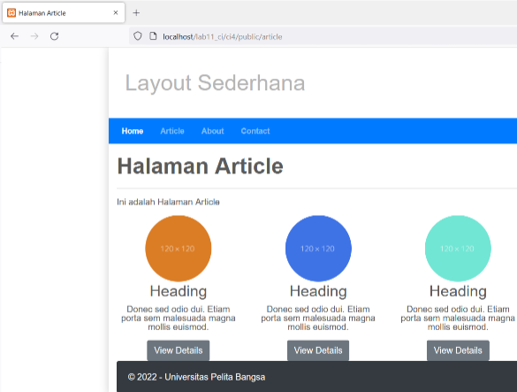 
3. Contact 
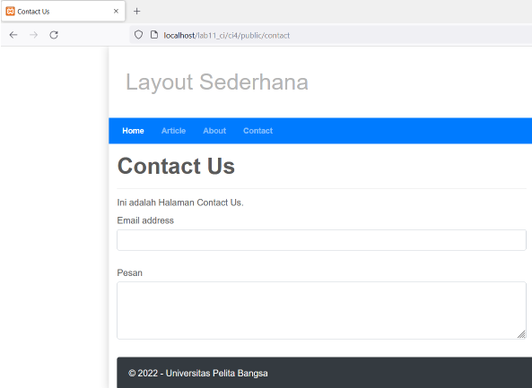 

Sekian dari saya 
Terimakasih.... 
